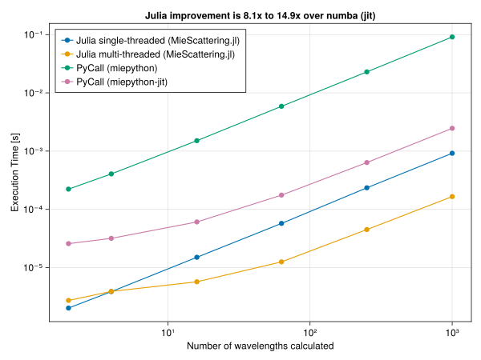

# Performance in comparison to miepython

The following snippets show how MieScattering.jl performs compared to miepython. The tests are performed by calling miepython using `PyCall`.
This might seem as an unfair comparison due to the (little) overhead of calling Python from Julia. However, if you are reading this you already want to use Julia for this task so resorting to PyCall might be your way to go anyway if there is no native Julia solution.

The performance is compared vs the jit-ed and non-jit-ed version. Additionally the Julia version is used with the parameter `use_threads=false`  in order to show the difference when using multi-threading in Julia (using the great package [Polyester.jl](https://github.com/JuliaSIMD/Polyester.jl)). Multi-threading is the default setting, even though there is a slight disadvantage for small workloads. Even in single-threaded operation MieScattering.jl gives slightly better performance compared to the numba-accelerated miepython version (which essentially also does LLVM compilation of the Python code).

## Version info

```
Julia Version 1.8.2
Commit 36034abf260 (2022-09-29 15:21 UTC)
Platform Info:
  OS: macOS (arm64-apple-darwin21.3.0)
  CPU: 10 × Apple M1 Pro
  WORD_SIZE: 64
  LIBM: libopenlibm
  LLVM: libLLVM-13.0.1 (ORCJIT, apple-m1)
  Threads: 8 on 8 virtual cores
Environment:
  JULIA_EDITOR = code

sys.version = "3.10.6 | packaged by conda-forge | (main, Aug 22 2022, 20:40:44) [Clang 13.0.1 ]"
```

## Size parameter

```julia
using MieScattering
using BenchmarkTools
using PyCall
using Conda
Conda.pip_interop(true)
Conda.pip("install", "miepython")
using CairoMakie

miepython_jit = pyimport("miepython.miepython")
miepython = pyimport("miepython.miepython_nojit")

ntests = 6
m = 1.5
N = round.(Int, 10 .^ (LinRange(0, 3, ntests)))
N[1] = 2

result = zeros(ntests)
result_threads = zeros(ntests)
result_python = zeros(ntests)
result_python_jit = zeros(ntests)

for i = 1:ntests
    x = collect(LinRange(0.1, 20.0, N[i]))
    a = @benchmark mie($m, $x, use_threads=false)
    result[i] = median(a).time
    a = @benchmark mie($m, $x)
    result_threads[i] = median(a).time
    a = @benchmark miepython.mie($m, $x)
    result_python[i] = median(a).time
    a = @benchmark miepython_jit.mie($m, $x)
    result_python_jit[i] = median(a).time
end

imp = result_python_jit ./ result_threads

minimp, maximp = extrema(imp)

fig = Figure()
ax =
    fig[1, 1] = Axis(
        fig,
        yscale = log10,
        xscale = log10,
        xlabel = "Number of sphere sizes calculated",
        ylabel = "Execution Time [s]",
        title = "Julia improvement is $(round(minimp,digits=1))x to $(round(maximp,digits=1))x over numba (jit)",
    )
scatterlines!(N, result * 1e-9, label = "Julia single-threaded (MieScattering.jl)")
scatterlines!(N, result_threads * 1e-9, label = "Julia multi-threaded (MieScattering.jl)")
scatterlines!(N, result_python * 1e-9, label = "PyCall (miepython)")
scatterlines!(N, result_python_jit * 1e-9, label = "PyCall (miepython-jit)")
axislegend(ax; position = :lt)
fig
```


## Embedded spheres

```julia
ntests = 6
mwater = 4/3
m = 1.0
mm = m/mwater
r = 500 # nm

N = round.(Int, 10 .^ (LinRange(0, 3, ntests)))
N[1] = 2

result = zeros(ntests)
result_threads = zeros(ntests)
result_python = zeros(ntests)
result_python_jit = zeros(ntests)

for i = 1:ntests
    λ0 = collect(LinRange(300, 800, N[i]))
    xx = 2π*r*mwater./λ0
    a = @benchmark mie($mm, $xx, use_threads=false)
    result[i] = median(a).time
    a = @benchmark mie($mm, $xx)
    result_threads[i] = median(a).time
    a = @benchmark miepython.mie($mm, $xx)
    result_python[i] = median(a).time
    a = @benchmark miepython_jit.mie($mm, $xx)
    result_python_jit[i] = median(a).time
end

imp = result_python_jit ./ result_threads

minimp, maximp = extrema(imp)

fig = Figure()
ax =
    fig[1, 1] = Axis(
        fig,
        yscale = log10,
        xscale = log10,
        xlabel = "Number of wavelengths calculated",
        ylabel = "Execution Time [s]",
        title = "Julia improvement is $(round(minimp,digits=1))x to $(round(maximp,digits=1))x over numba (jit)",
    )
scatterlines!(N, result * 1e-9, label = "Julia single-threaded (MieScattering.jl)")
scatterlines!(N, result_threads * 1e-9, label = "Julia multi-threaded (MieScattering.jl)")
scatterlines!(N, result_python * 1e-9, label = "PyCall (miepython)")
scatterlines!(N, result_python_jit * 1e-9, label = "PyCall (miepython-jit)")
axislegend(ax; position = :lt)
fig
```



## `ez_mie` testing

```julia
ntests = 6
m_sphere = 1.0
n_water = 4/3
d = 1000 # nm

N = round.(Int, 10 .^ (LinRange(0, 3, ntests)))
N[1] = 2

result = zeros(ntests)
result_threads = zeros(ntests)
result_python = zeros(ntests)
result_python_jit = zeros(ntests)

for i = 1:ntests
    λ0 = collect(LinRange(300, 800, N[i]))
    a = @benchmark ez_mie($m_sphere, $d, $λ0, $n_water, use_threads=false)
    result[i] = median(a).time
    a = @benchmark ez_mie($m_sphere, $d, $λ0, $n_water)
    result_threads[i] = median(a).time
    a = @benchmark miepython.ez_mie($m_sphere, $d, $λ0, $n_water)
    result_python[i] = median(a).time
    a = @benchmark miepython_jit.ez_mie($m_sphere, $d, $λ0, $n_water)
    result_python_jit[i] = median(a).time
end

imp = result_python_jit ./ result_threads

minimp, maximp = extrema(imp)

fig = Figure()
ax =
    fig[1, 1] = Axis(
        fig,
        yscale = log10,
        xscale = log10,
        xlabel = "Number of wavelengths calculated",
        ylabel = "Execution Time [s]",
        title = "Julia improvement is $(round(minimp,digits=1))x to $(round(maximp,digits=1))x over numba (jit)",
    )
scatterlines!(N, result * 1e-9, label = "Julia single-threaded (MieScattering.jl)")
scatterlines!(N, result_threads * 1e-9, label = "Julia multi-threaded (MieScattering.jl)")
scatterlines!(N, result_python * 1e-9, label = "PyCall (miepython)")
scatterlines!(N, result_python_jit * 1e-9, label = "PyCall (miepython-jit)")
axislegend(ax; position = :lt)
fig
```


## Scattering Phase Function

```julia
ntests = 6
m = 1.5
x = π/3

N = round.(Int, 10 .^ (LinRange(0, 3, ntests)))
N[1] = 2

result = zeros(ntests)
result_threads = zeros(ntests)
result_python = zeros(ntests)
result_python_jit = zeros(ntests)

for i = 1:ntests
    θ = LinRange(-180, 180, N[i])
    μ = cosd.(θ)
    a = @benchmark mie_S1_S2($m, $x, $μ, use_threads=false)
    result[i] = median(a).time
    a = @benchmark mie_S1_S2($m, $x, $μ)
    result_threads[i] = median(a).time
    a = @benchmark miepython.mie_S1_S2($m, $x, $μ)
    result_python[i] = median(a).time
    a = @benchmark miepython_jit.mie_S1_S2($m, $x, $μ)
    result_python_jit[i] = median(a).time
end

imp = result_python_jit ./ result_threads

minimp, maximp = extrema(imp)

fig = Figure()
ax =
    fig[1, 1] = Axis(
        fig,
        yscale = log10,
        xscale = log10,
        xlabel = "Number of angles calculated",
        ylabel = "Execution Time [s]",
        title = "Julia improvement is $(round(minimp,digits=1))x to $(round(maximp,digits=1))x over numba (jit)",
    )
scatterlines!(N, result * 1e-9, label = "Julia single-threaded (MieScattering.jl)")
scatterlines!(N, result_threads * 1e-9, label = "Julia multi-threaded (MieScattering.jl)")
scatterlines!(N, result_python * 1e-9, label = "PyCall (miepython)")
scatterlines!(N, result_python_jit * 1e-9, label = "PyCall (miepython-jit)")
axislegend(ax; position = :lt)
fig
```


## As a function of sphere size

```julia
ntests = 6
m = 1.5 - 0.1*im

x = round.(Int, 10 .^ (LinRange(0, 3, ntests)))

θ = LinRange(-180, 180, 50)
μ = cosd.(θ)

result = zeros(ntests)
result_threads = zeros(ntests)
result_python = zeros(ntests)
result_python_jit = zeros(ntests)

for i = 1:ntests
    a = @benchmark mie_S1_S2($m, $x[$i], $μ, use_threads=false)
    result[i] = median(a).time
    a = @benchmark mie_S1_S2($m, $x[$i], $μ)
    result_threads[i] = median(a).time
    a = @benchmark miepython.mie_S1_S2($m, $x[$i], $μ)
    result_python[i] = median(a).time
    a = @benchmark miepython_jit.mie_S1_S2($m, $x[$i], $μ)
    result_python_jit[i] = median(a).time
end

imp = result_python_jit ./ result_threads

minimp, maximp = extrema(imp)

fig = Figure()
ax =
    fig[1, 1] = Axis(
        fig,
        yscale = log10,
        xscale = log10,
        xlabel = "Sphere size parameter",
        ylabel = "Execution Time [s]",
        title = "Julia improvement is $(round(minimp,digits=1))x to $(round(maximp,digits=1))x over numba (jit)",
    )
scatterlines!(N, result * 1e-9, label = "Julia single-threaded (MieScattering.jl)")
scatterlines!(N, result_threads * 1e-9, label = "Julia multi-threaded (MieScattering.jl)")
scatterlines!(N, result_python * 1e-9, label = "PyCall (miepython)")
scatterlines!(N, result_python_jit * 1e-9, label = "PyCall (miepython-jit)")
axislegend(ax; position = :lt)
fig
```

